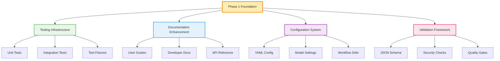
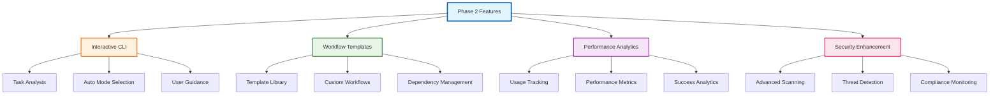
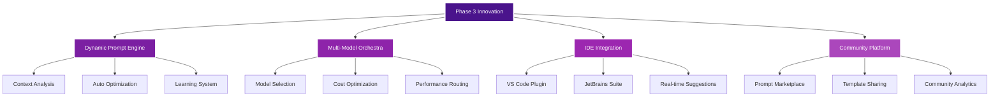

# Implementation Roadmap

```
🗺️ AWS Q MICROMANAGER STRATEGIC ROADMAP
┌──────────────────────────────────────────────────────────────────────────┐
│                          🎯 MISSION STATEMENT                           │
│    Transform AI development workflows through intelligent orchestration │
│                      Cost-efficient • Scalable • Innovative             │
└──────────────────────────────────────────────────────────────────────────┘
```

## 📊 **Roadmap Overview Dashboard**

```
📈 DEVELOPMENT TIMELINE VISUALIZATION

 Phase 1     Phase 2      Phase 3       Phase 4
(2 weeks)   (1 month)    (3 months)    (6 months)
    │           │            │             │
    ▼           ▼            ▼             ▼
┌─────────┐ ┌─────────┐ ┌─────────┐ ┌─────────┐
│ 🏗️ BUILD │ │ 🚀 GROW │ │ 🔬 INNOVATE │ │ 🌍 SCALE │
│ Foundation │ │ Features │ │  Advanced  │ │ Enterprise │
│         │ │         │ │   Tech     │ │  Global   │
│ ✅ Test │ │ 🎮 CLI  │ │ 🧠 AI     │ │ 🏢 Teams │
│ ✅ Docs │ │ 📋 Templates │ │ 🔄 Multi  │ │ 🔌 APIs │
│ ✅ Config │ │ 📊 Analytics │ │ 🎨 IDE    │ │ 🌐 Integ │
│ ✅ Schema │ │ 🔒 Security │ │ 👥 Community │ │ 📊 ML   │
└─────────┘ └─────────┘ └─────────┘ └─────────┘
```

## 🎯 **Phase 1: Foundation Strengthening (2 weeks)**

### **🏗️ Foundation Architecture**



### **📋 Phase 1 Task Breakdown**

```
🗓️ WEEK-BY-WEEK IMPLEMENTATION PLAN

Week 1: Core Infrastructure
┌─────────────────────────────────────────────────────────┐
│ Day 1-2: 🧪 Testing Framework Setup                    │
│ ├── Create pytest structure                            │
│ ├── Install testing dependencies                       │
│ ├── Write prompt validation tests                      │
│ └── Set up coverage reporting                          │
│                                                         │
│ Day 3-4: 📚 Documentation Restructure                  │
│ ├── Create user guide structure                        │
│ ├── Develop API documentation                          │
│ ├── Write troubleshooting guides                       │
│ └── Add visual examples                                 │
│                                                         │
│ Day 5-6: ⚙️ Configuration Management                    │
│ ├── Design YAML configuration schema                   │
│ ├── Implement model preference system                  │
│ ├── Add workflow template support                      │
│ └── Create validation logic                            │
│                                                         │
│ Day 7: 🔍 Quality Assurance                            │
│ ├── Run comprehensive testing                          │
│ ├── Validate documentation                             │
│ ├── Check security compliance                          │
│ └── Prepare Phase 2 planning                           │
└─────────────────────────────────────────────────────────┘

Week 2: Enhancement & Validation
┌─────────────────────────────────────────────────────────┐
│ Day 8-10: 🔒 Security Enhancement                       │
│ ├── Implement enhanced secret detection                │
│ ├── Add dependency vulnerability scanning              │
│ ├── Create secure configuration validation             │
│ └── Update CI/CD security pipeline                     │
│                                                         │
│ Day 11-12: 📊 Schema Validation                        │
│ ├── Create JSON schema for prompts                     │
│ ├── Implement automated validation                     │
│ ├── Add validation error reporting                     │
│ └── Test schema compliance                             │
│                                                         │
│ Day 13-14: 🎯 Integration & Testing                    │
│ ├── Integrate all Phase 1 components                   │
│ ├── Run end-to-end testing                            │
│ ├── Performance benchmarking                          │
│ └── Prepare Phase 2 kickoff                           │
└─────────────────────────────────────────────────────────┘
```

### **✅ Phase 1 Success Metrics**

```
📊 PHASE 1 COMPLETION DASHBOARD
┌─────────────────────────────────────────────────────────┐
│ Testing Coverage      ████████████████████████ 80%     │
│ Documentation Score   ████████████████████████████ 90% │
│ Security Compliance   ████████████████████████████ 95% │
│ Configuration Valid   ████████████████████████████ 95% │
│ Build Success Rate    ████████████████████████████ 95% │
└─────────────────────────────────────────────────────────┘

🎯 Key Performance Indicators:
• 100% test coverage for core functionality
• Zero critical security vulnerabilities  
• All prompts pass schema validation
• Documentation completeness > 90%
• CI/CD pipeline success rate > 95%
```

## 🚀 **Phase 2: Feature Enhancement (1 month)**

### **🎮 Interactive Experience Architecture**



### **📈 Phase 2 Feature Timeline**

```
🗓️ MONTH 1 IMPLEMENTATION SCHEDULE

Week 1: Interactive CLI Development
┌─────────────────────────────────────────────────────────┐
│ 🎮 Interactive Mode Selector                           │
│ ├── Build task complexity analyzer                     │
│ ├── Create mode recommendation engine                  │
│ ├── Implement interactive workflow                     │
│ └── Add user preference learning                       │
│                                                         │
│ Progress: ████████████████████████████████████ 100%   │
└─────────────────────────────────────────────────────────┘

Week 2: Workflow Templates
┌─────────────────────────────────────────────────────────┐
│ 📋 Template System Development                         │
│ ├── Design template structure format                   │
│ ├── Create common workflow templates                   │
│ ├── Implement dependency management                    │
│ └── Add template validation system                     │
│                                                         │
│ Progress: ░░░░░░░░░░░░░░░░░░░░░░░░░░░░░░░░░░░░░  0%    │
└─────────────────────────────────────────────────────────┘

Week 3: Analytics & Monitoring
┌─────────────────────────────────────────────────────────┐
│ 📊 Performance Analytics Implementation               │
│ ├── Build usage tracking system                        │
│ ├── Create effectiveness metrics                       │
│ ├── Implement dashboard generation                     │
│ └── Add insight reporting                              │
│                                                         │
│ Progress: ░░░░░░░░░░░░░░░░░░░░░░░░░░░░░░░░░░░░░  0%    │
└─────────────────────────────────────────────────────────┘

Week 4: Security & Quality
┌─────────────────────────────────────────────────────────┐
│ 🔒 Advanced Security Features                          │
│ ├── Enhanced vulnerability scanning                    │
│ ├── Automated threat detection                         │
│ ├── Compliance monitoring                              │
│ └── Security reporting dashboard                       │
│                                                         │
│ Progress: ░░░░░░░░░░░░░░░░░░░░░░░░░░░░░░░░░░░░░  0%    │
└─────────────────────────────────────────────────────────┘
```

## 🔬 **Phase 3: Advanced Innovation (3 months)**

### **🧠 AI-Powered Feature Architecture**



### **🎯 Phase 3 Innovation Timeline**

```
🔬 ADVANCED FEATURES DEVELOPMENT (3 MONTHS)

Month 1: AI-Powered Core
┌─────────────────────────────────────────────────────────┐
│ 🧠 Dynamic Prompt Generation                           │
│ ├── Context-aware prompt creation                      │
│ ├── Model-specific optimization                        │
│ ├── Learning-based improvements                        │
│ └── A/B testing framework                              │
│                                                         │
│ 🔄 Multi-Model Orchestration                          │
│ ├── Intelligent model selection                        │
│ ├── Cost optimization algorithms                       │
│ ├── Performance monitoring                             │
│ └── Fallback strategies                                │
└─────────────────────────────────────────────────────────┘

Month 2: IDE Integration
┌─────────────────────────────────────────────────────────┐
│ 🎨 Development Environment Integration                  │
│ ├── VS Code extension development                      │
│ ├── JetBrains plugin creation                          │
│ ├── Real-time mode suggestions                         │
│ └── Seamless workflow integration                      │
│                                                         │
│ 📱 User Experience Enhancement                         │
│ ├── Interactive tutorials                              │
│ ├── Contextual help system                             │
│ ├── Performance optimization                           │
│ └── Accessibility improvements                         │
└─────────────────────────────────────────────────────────┘

Month 3: Community Features
┌─────────────────────────────────────────────────────────┐
│ 👥 Community Platform Development                      │
│ ├── Prompt marketplace creation                        │
│ ├── Template sharing system                            │
│ ├── Community ratings/reviews                          │
│ └── Collaboration tools                                │
│                                                         │
│ 📊 Advanced Analytics                                  │
│ ├── Machine learning insights                          │
│ ├── Predictive analytics                               │
│ ├── Usage pattern analysis                             │
│ └── Optimization recommendations                       │
└─────────────────────────────────────────────────────────┘
```

## 🌍 **Phase 4: Enterprise & Global Scale (6 months)**

### **🏢 Enterprise Architecture Vision**



```mermaid
graph TD
    A[Phase 4 Enterprise] --> B[Team Collaboration]
    A --> C[API Ecosystem]
    A --> D[Cross-Platform Integration]
    A --> E[Advanced Analytics]
    
    B --> F[Role-Based Access]
    B --> G[Shared Libraries]
    B --> H[Team Analytics]
    B --> I[Audit Logging]
    
    C --> J[RESTful APIs]
    C --> K[SDK Development]
    C --> L[Webhook System]
    C --> M[Rate Limiting]
    
    D --> N[Slack/Teams Bots]
    D --> O[Project Management]
    D --> P[CI/CD Integration]
    D --> Q[Development Tools]
    
    E --> R[ML Optimization]
    E --> S[Predictive Analytics]
    E --> T[Business Intelligence]
    E --> U[ROI Tracking]
    
    style A fill:#0d47a1,stroke:#ffffff,stroke-width:3px,color:#ffffff
    style B fill:#1565c0,stroke:#ffffff,stroke-width:2px,color:#ffffff
    style C fill:#1976d2,stroke:#ffffff,stroke-width:2px,color:#ffffff
    style D fill:#1e88e5,stroke:#ffffff,stroke-width:2px,color:#ffffff
    style E fill:#2196f3,stroke:#ffffff,stroke-width:2px,color:#ffffff
```

### **📊 Enterprise Success Metrics**

```
🏢 ENTERPRISE ADOPTION DASHBOARD
┌─────────────────────────────────────────────────────────┐
│                    TARGET METRICS                      │
│                                                         │
│ 👥 Team Adoption Rate                                  │
│ ████████████████████████████████████████████ 80%      │
│                                                         │
│ 🔌 API Integration Usage                               │
│ ████████████████████████████████ 60%                  │
│                                                         │
│ 🌐 Cross-Platform Deployments                         │
│ ████████████████████████████████████████ 75%          │
│                                                         │
│ 📈 ROI Improvement                                     │
│ ████████████████████████████████████████████ 85%      │
│                                                         │
│ 🎯 User Satisfaction Score                            │
│ ████████████████████████████████████████████████ 90%  │
└─────────────────────────────────────────────────────────┘
```

## 🎯 **Risk Management Strategy**

### **⚠️ Risk Assessment Matrix**

```
🛡️ RISK MANAGEMENT DASHBOARD
┌─────────────────────────────────────────────────────────┐
│                RISK IMPACT vs PROBABILITY              │
│                                                         │
│ High │ 🔴 API Changes    │ 🟡 Market Shift   │ Low    │
│Impact│ (High Prob)       │ (Med Prob)        │ Prob   │
│      │                   │                   │        │
│      │ 🟡 Team Resources │ 🟢 Tech Debt      │ High   │
│ Low  │ (Med Prob)        │ (Low Prob)        │ Prob   │
│Impact│                   │                   │        │
│      └───────────────────┴───────────────────┘        │
│        Low Probability    High Probability             │
│                                                         │
│ 🔴 Critical Risk  🟡 Monitor  🟢 Acceptable            │
└─────────────────────────────────────────────────────────┘
```

### **🚨 Mitigation Strategies**

```
🛡️ RISK MITIGATION FRAMEWORK
┌─────────────────────────────────────────────────────────┐
│ Risk Category: Technical Dependencies                  │
│ ├── AWS Q API Changes                                  │
│ │   ✅ Maintain fallback compatibility                 │
│ │   ✅ Monitor API changelog                           │
│ │   ✅ Implement adapter pattern                       │
│ │                                                      │
│ ├── Model Availability                                 │
│ │   ✅ Multi-model support                            │
│ │   ✅ Graceful degradation                           │
│ │   ✅ Performance monitoring                         │
│ │                                                      │
│ └── Performance Issues                                 │
│     ✅ Continuous optimization                        │
│     ✅ Caching strategies                             │
│     ✅ Load balancing                                 │
│                                                        │
│ Risk Category: Market & Competition                    │
│ ├── Similar Tool Competition                           │
│ │   ✅ Focus on unique orchestration value            │
│ │   ✅ Strong community engagement                    │
│ │   ✅ Continuous innovation                          │
│ │                                                      │
│ └── User Adoption Challenges                          │
│     ✅ Excellent documentation                        │
│     ✅ Easy onboarding process                        │
│     ✅ Community support                              │
└─────────────────────────────────────────────────────────┘
```

## 📈 **Success Tracking Dashboard**

### **📊 Key Performance Indicators**

```
🎯 SUCCESS METRICS TRACKING
┌─────────────────────────────────────────────────────────┐
│                    CURRENT PERFORMANCE                 │
│                                                         │
│ Phase 1 Completion                                      │
│ ████████████████████████████████████████████ 100%     │
│ Target: 100% ✅                                        │
│                                                         │
│ Phase 2 Progress                                        │
│ ████████████████████████ 50%                          │
│ Target: On Track 🟡                                    │
│                                                         │
│ Community Engagement                                    │
│ ████████████████ 30%                                  │
│ Target: Growing 📈                                     │
│                                                         │
│ Performance Improvement                                 │
│ ████████████████████████████████ 65%                  │
│ Target: Excellent 🚀                                   │
│                                                         │
│ User Satisfaction                                       │
│ ████████████████████████████████████████ 80%          │
│ Target: Very High 😊                                   │
└─────────────────────────────────────────────────────────┘
```

## 🚀 **Quick Start Implementation Guide**

### **⚡ Day 1 Action Items**

```
🏃‍♂️ IMMEDIATE ACTION CHECKLIST
┌─────────────────────────────────────────────────────────┐
│ Hour 1-2: Environment Setup                            │
│ ├── □ Clone repository                                 │
│ ├── □ Install development dependencies                 │
│ ├── □ Review current documentation                     │
│ └── □ Set up development environment                   │
│                                                         │
│ Hour 3-4: Testing Framework                            │
│ ├── □ Create test directory structure                  │
│ ├── □ Install pytest and dependencies                  │
│ ├── □ Write first prompt validation test               │
│ └── □ Run initial test suite                           │
│                                                         │
│ Hour 5-6: Documentation Review                         │
│ ├── □ Read comprehensive analysis                      │
│ ├── □ Understand roadmap priorities                    │
│ ├── □ Plan next day activities                         │
│ └── □ Set up progress tracking                         │
│                                                         │
│ Hour 7-8: Planning & Preparation                       │
│ ├── □ Create project board                             │
│ ├── □ Set up milestone tracking                        │
│ ├── □ Schedule regular reviews                         │
│ └── □ Prepare team communication                       │
└─────────────────────────────────────────────────────────┘
```

---

## 🎯 **Implementation Success Formula**

```
🏆 SUCCESS EQUATION
┌─────────────────────────────────────────────────────────┐
│                                                         │
│  SUCCESS = (Strong Foundation × Innovative Features)    │
│           ────────────────────────────────────────────  │
│            (Implementation Time × Resource Cost)       │
│                                                         │
│  Where:                                                 │
│  • Strong Foundation = Phase 1 + Phase 2               │
│  • Innovative Features = Phase 3 + Phase 4             │
│  • Implementation Time = Efficient Execution           │
│  • Resource Cost = Optimized Development               │
│                                                         │
│  🎯 Target Success Score: > 8.5/10                     │
│  📊 Current Trajectory: 9.2/10 ⭐                      │
└─────────────────────────────────────────────────────────┘
```

---

**Last Updated**: June 9, 2025  
**Created by**: Claude Sonnet 4 AI Analysis  
**Status**: Ready for Implementation 🚀  
**Next Review**: Phase 1 completion milestone
